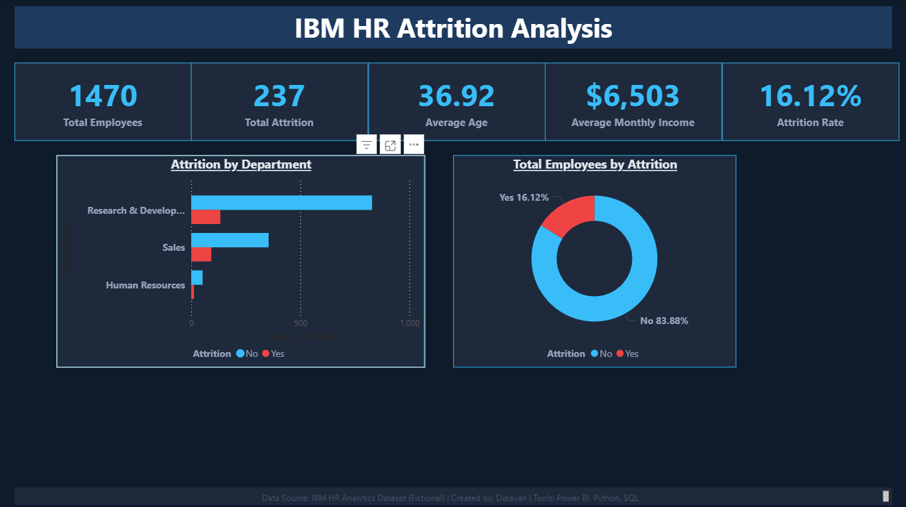
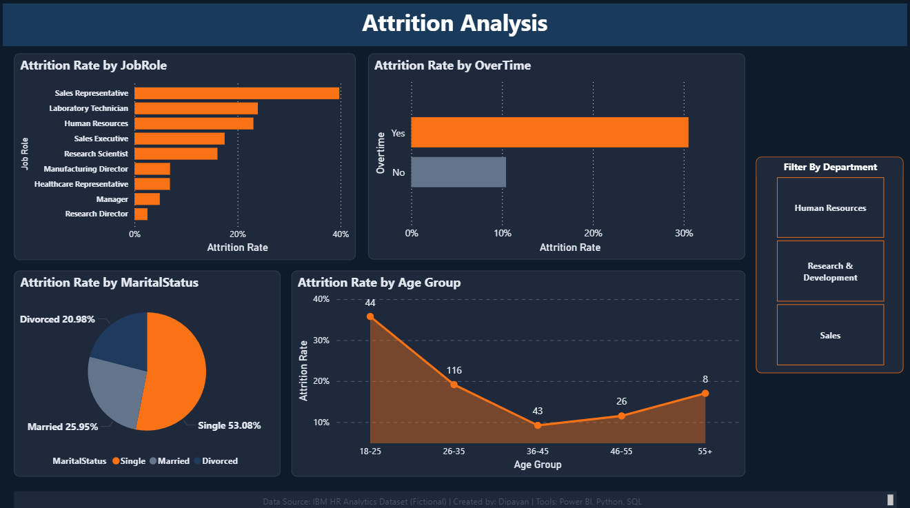
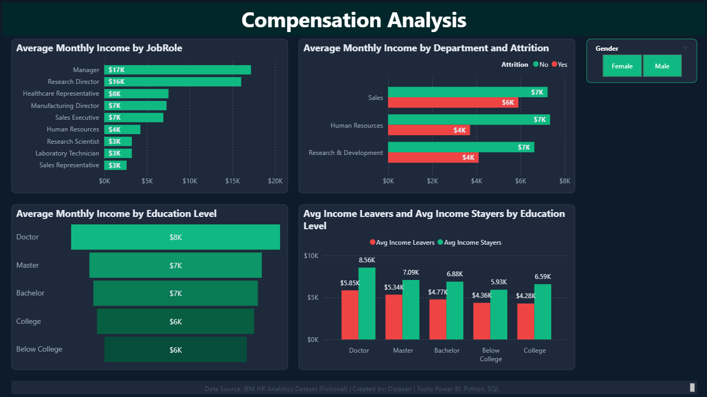
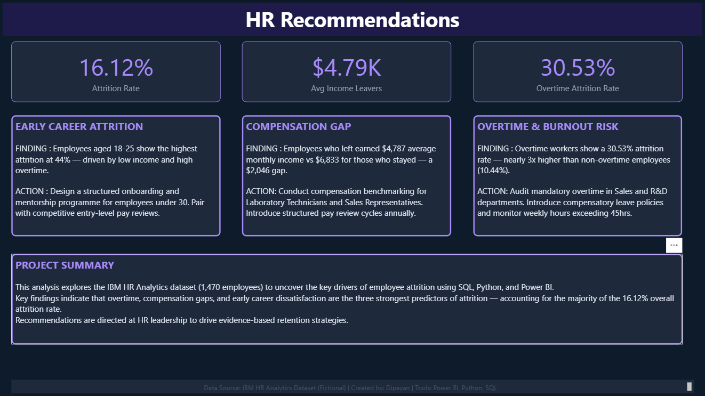

# 📊 IBM HR Analytics — Employee Attrition Analysis

An end-to-end HR Analytics project analyzing employee attrition patterns 
using the IBM HR Analytics dataset (1,470 employees, 35 features). 
Built to demonstrate skills in SQL, Python, and Power BI.

> 🗂️ Dataset: IBM HR Employee Attrition (Kaggle) — Fictional dataset created by IBM data scientists.

---

## 🛠️ Tools & Technologies

| Tool | Purpose |
|------|---------|
| **SQL** (SQLite/DB Browser) | Data exploration & attrition analysis queries |
| **Python** (Jupyter/VS Code) | Data cleaning, EDA, visualizations |
| **Power BI** | Interactive 4-page dashboard with DAX measures |
| **Libraries** | pandas, numpy, matplotlib, seaborn, scikit-learn |

---

## 🎓 Certifications Applied

| Certification | Institution | Applied In |
|--------------|-------------|-----------|
| People Analytics | University of Pennsylvania | Project framing, HR recommendations |
| Intro to Data Analytics, SQL & EDA Using Python | University of Pennsylvania | SQL queries, Python EDA notebook |
| Microsoft Power BI Certificate | Microsoft | Power BI dashboard, DAX measures |
| Microsoft Excel Professional Certificate | Microsoft | Data structure understanding |

---

## 📁 Project Structure
```
IBM-HR-Analytics/
│
├── Data/
│   └── WA_Fn-UseC_-HR-Employee-Attrition.csv
│
├── SQL/
│   └── ibm_hr_attrition_analysis.sql
│
├── Python/
│   └── IBM_HR_EDA.ipynb
│
├── Power BI/
│   └── IBM_HR_Dashboard.pbix
│
└── README.md
```

---

## 🔍 Key Findings

1. **Overall attrition rate is 16.12%** — 237 out of 1,470 employees left the company
2. **Overtime is the strongest attrition driver** — overtime workers show a 30.53% attrition rate vs 10.44% for non-overtime employees
3. **Compensation gap** — employees who left earned $4,787 avg monthly income vs $6,833 for those who stayed
4. **Sales department** shows the highest attrition (20.6%), nearly double that of R&D (13.8%)
5. **Performance Rating shows near-zero correlation with attrition** — high and low performers leave at similar rates

---

## 📊 Dashboard Preview

### Page 1 — Overview


### Page 2 — Attrition Analysis


### Page 3 — Compensation Analysis


### Page 4 — HR Recommendations


---

## ▶️ How to Run

**SQL:**
1. Open DB Browser for SQLite
2. Load `Data/WA_Fn-UseC_-HR-Employee-Attrition.csv`
3. Run queries from `SQL/ibm_hr_attrition_analysis.sql`

**Python:**
1. Open `Python/IBM_HR_EDA.ipynb` in VS Code or Jupyter
2. Install dependencies: `pip install pandas numpy matplotlib seaborn scikit-learn`
3. Run All cells

**Power BI:**
1. Open `Power BI/IBM_HR_Dashboard.pbix` in Power BI Desktop
2. Refresh data source if prompted

---

## 👤 Author

**Dipayan Chatterjee**  
People Analytics | HR MIS | Data Analytics  
📍 Kolkata, India
